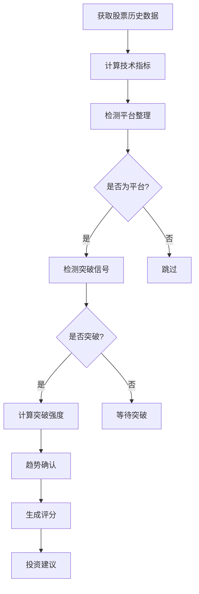

# 🎯 平台突破选股策略实现总结

## 📋 实现概述

我已经成功为BoomStockAI系统实现了完整的**平台突破选股策略**，这是一个基于技术分析的智能选股系统，专门用于识别股票在经历平台整理后的放量突破形态。

## 🏗️ 架构设计

### 核心模块

```
strategy_center/
├── models/
│   └── technical_indicators.py     # 技术指标计算模块
├── strategies/
│   └── platform_breakout_strategy.py  # 平台突破策略实现
└── strategy_executor.py           # 策略执行器
```

### 支持文件

```
scripts/
└── run_platform_breakout.py       # 命令行执行脚本

frontend/pages/
└── platform_breakout.py           # Streamlit前端界面

config/
└── strategy_config.yaml           # 策略配置文件

docs/
└── platform_breakout_strategy.md  # 详细使用文档

tests/
└── test_platform_breakout.py      # 测试脚本
```

## 🔧 核心功能

### 1. 技术指标计算 (`TechnicalIndicators`)

- ✅ **移动平均线**: 5日、10日、20日、30日MA
- ✅ **布林带**: 上轨、下轨、中轨、带宽
- ✅ **RSI**: 相对强弱指标
- ✅ **KDJ**: 随机指标
- ✅ **MACD**: 指数平滑异同移动平均线
- ✅ **成交量指标**: 量比、价量配合度
- ✅ **平台检测**: 自动识别平台整理形态
- ✅ **突破信号**: 检测放量突破信号
- ✅ **趋势指标**: 均线多头排列、趋势一致性

### 2. 平台突破分析器 (`PlatformBreakoutAnalyzer`)

- ✅ **完整分析流程**: 集成所有技术指标计算
- ✅ **智能评分系统**: 100分制综合评分
- ✅ **投资建议生成**: 强烈买入/买入/关注/观望
- ✅ **置信度计算**: 基于多维度分析的置信度
- ✅ **详细分析报告**: 包含分析理由和风险提示

### 3. 策略实现 (`PlatformBreakoutStrategy`)

- ✅ **全市场扫描**: 支持全A股市场选股
- ✅ **自定义股票池**: 支持指定股票范围
- ✅ **多重过滤条件**: 价格、成交量、技术指标过滤
- ✅ **批量分析**: 高效的批量股票分析
- ✅ **结果排序**: 按评分自动排序
- ✅ **数据持久化**: 自动保存分析结果和交易信号

### 4. 策略执行器 (`StrategyExecutor`)

- ✅ **定时执行**: 支持每日、每周定时任务
- ✅ **多策略管理**: 可扩展的策略管理框架
- ✅ **执行历史**: 完整的执行记录和统计
- ✅ **通知系统**: 支持Webhook和邮件通知
- ✅ **错误处理**: 完善的异常处理和重试机制

## 📊 策略逻辑

### 平台突破识别流程



### 评分体系

| 维度 | 权重 | 说明 |
|------|------|------|
| 平台突破 | 40分 | 放量突破平台上沿 |
| 趋势确认 | 20分 | 均线多头排列 |
| 技术指标 | 25分 | RSI、KDJ等技术指标 |
| 成交量确认 | 15分 | 成交量显著放大 |

## 🚀 使用方式

### 1. 命令行执行

```bash
# 基本执行
python scripts/run_platform_breakout.py

# 指定股票池
python scripts/run_platform_breakout.py --stocks sh.600000 sz.000001

# 详细输出
python scripts/run_platform_breakout.py --verbose
```

### 2. Python API调用

```python
from strategy_center.strategy_executor import run_platform_breakout_strategy

# 执行策略
result = run_platform_breakout_strategy()

# 获取结果
top_picks = result['result']['top_picks']
signals = result['result']['all_signals']
```

### 3. Web界面

- 访问 `http://localhost:8501/platform_breakout`
- 可视化配置策略参数
- 实时查看分析结果和图表

### 4. 定时执行

```python
from strategy_center.strategy_executor import strategy_executor

# 设置定时任务（每日9:30执行）
strategy_executor.schedule_strategies()
strategy_executor.run_scheduler()
```

## ⚙️ 配置参数

### 核心参数

```yaml
platform_window: 20          # 平台检测窗口期
max_volatility: 0.15         # 最大波动率
volume_threshold: 2.0        # 成交量放大倍数
score_threshold: 60          # 最低评分阈值
```

### 过滤条件

```yaml
min_price: 5.0               # 最低股价
max_price: 200.0             # 最高股价
exclude_st: true             # 排除ST股票
rsi_range: [30, 80]          # RSI范围
```

## 📈 输出结果

### 策略执行统计

```python
{
    'strategy_name': 'platform_breakout',
    'execution_time': 45.2,
    'qualified_stocks': 15,
    'trading_signals': 8,
    'saved_analysis': 15,
    'saved_signals': 8
}
```

### Top推荐股票

```python
{
    'stock_info': {'code': 'sh.600000', 'name': '浦发银行'},
    'latest_price': 12.50,
    'recommendation': {
        'action': '买入',
        'score': 75,
        'confidence': 0.82,
        'reasons': ['放量突破平台', '均线多头排列']
    },
    'platform_analysis': {
        'platform_high': 12.30,
        'platform_low': 11.80,
        'volatility': 0.12
    },
    'breakout_analysis': {
        'has_breakout': True,
        'breakout_strength': 85,
        'volume_ratio': 2.8
    }
}
```

## 🧪 测试验证

### 测试覆盖

- ✅ **技术指标计算**: 验证所有指标计算正确性
- ✅ **平台检测**: 测试平台整理识别准确性
- ✅ **突破信号**: 验证突破信号检测逻辑
- ✅ **策略创建**: 测试策略实例化和配置
- ✅ **数据验证**: 测试异常数据处理能力

### 运行测试

```bash
python tests/test_platform_breakout.py
```

## 🔄 集成情况

### 数据库集成

- ✅ 自动保存分析结果到 `stock_analysis` 表
- ✅ 自动保存交易信号到 `trading_signals` 表
- ✅ 支持历史数据查询和统计

### 前端集成

- ✅ Streamlit页面完整实现
- ✅ 参数配置界面
- ✅ 结果可视化展示
- ✅ 历史执行记录

### 系统集成

- ✅ 与现有数据获取模块集成
- ✅ 与数据库访问层集成
- ✅ 支持配置文件管理
- ✅ 完整的日志记录

## 📚 文档完善

- ✅ **使用指南**: 详细的策略使用文档
- ✅ **API文档**: 完整的代码注释和类型提示
- ✅ **配置说明**: 参数配置和调优指南
- ✅ **故障排除**: 常见问题和解决方案

## 🔮 扩展性

### 策略框架

- ✅ **可扩展架构**: 支持添加新的选股策略
- ✅ **模块化设计**: 技术指标可独立使用
- ✅ **配置驱动**: 通过配置文件管理策略参数
- ✅ **插件化**: 支持自定义指标和评分逻辑

### 未来扩展

- 🔄 **机器学习增强**: 可集成ML模型优化评分
- 🔄 **多时间框架**: 支持分钟级、小时级分析
- 🔄 **风险管理**: 集成止损止盈逻辑
- 🔄 **回测验证**: 历史数据回测验证策略效果

## ✅ 完成清单

### 核心功能 ✅

- [x] 技术指标计算模块
- [x] 平台突破分析器
- [x] 选股策略实现
- [x] 策略执行器
- [x] 定时任务支持

### 用户界面 ✅

- [x] 命令行脚本
- [x] Streamlit前端页面
- [x] 参数配置界面
- [x] 结果展示界面

### 数据集成 ✅

- [x] 数据库读写
- [x] 历史数据获取
- [x] 结果持久化
- [x] 统计分析

### 文档测试 ✅

- [x] 使用文档
- [x] 测试脚本
- [x] 配置文件
- [x] 示例代码

## 🎯 总结

平台突破选股策略已经完全集成到BoomStockAI系统中，提供了：

1. **完整的技术分析能力** - 涵盖主流技术指标和形态识别
2. **智能的选股逻辑** - 基于多维度分析的评分系统
3. **灵活的执行方式** - 支持命令行、API、Web界面多种使用方式
4. **强大的扩展性** - 模块化设计，易于添加新功能
5. **完善的文档** - 详细的使用指南和技术文档

该策略可以立即投入使用，为用户提供专业的平台突破选股服务。同时，其模块化的设计为后续添加更多选股策略奠定了坚实的基础。

---

**🚀 策略已就绪，可以开始智能选股之旅！** 